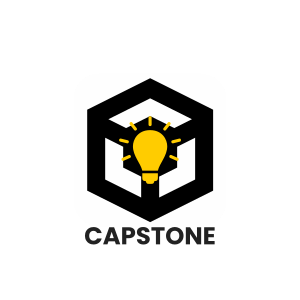

 
 
 
 
 

### Welcome to my GitHub profile! Here you will find my proudest works and learn more about who I am beyond the code. My goal is for this profile to serve not just as a technical showcase of repositories, but as a narrative of my growth and evolution through my journey in Computer Science.

### One transformative lesson life has taught me is that nothing is more important than what you do with what you have and that while meaning, in any context, is subjective, it is unequivocally real and nessessary for growth

## When I'm Not Coding:
- 🏕️ Taking long backpacking and camping trips across vast wilderness
- 🏊‍♂️ Decompressing after a long day by swimming laps or running at a local park 
- ☕ Trying every new coffee shop and bakery around
- ✈️ Traveling to new places and fully immersing myself in each location's uniqueness
- 🤝 Meeting new people from all walks of life and discovering their stories and niche interests
- 🎿 Skiing and completely disconnecting from technology
- 🌍 Completing service work with nonprofits to support local and international communities
- 📅 Planning my next adventure to a place I've never been
- 📸 Photographing and videographing beautiful expansive landscapes to symmetric concrete jungles
- 🌟 Living in the moment and cherishing every person and new experience I encounter

# 🎓Education

  
   
  <strong>Appalachian State University</strong>
   
  <em>Bachelor of Science in Computer Science</em>
   
  with a minor in Computer Information Systems

## Let's Talk:
- 📚 Ask me about my favorite project, my greatest accomplishment, or my most meaningful experience.
- 🎉 Fun fact: I studied abroad at the University of Oxford in the United Kingdom and took a course on Artificial Intelligence.

# 🚀 Connect with Me:

  
  
  
  
  

## Featured Project

  

# 🔥 Tech Stack:

  

# 📊 Tech Stats:

  <table>
    <tr>
      <td rowspan="3" width="35%" border="none">
        
      </td>
      <td align="left" border="none">
        
        
      </td>
    </tr>
  </table>

### ✍️ Random Dev Quote

  

     

